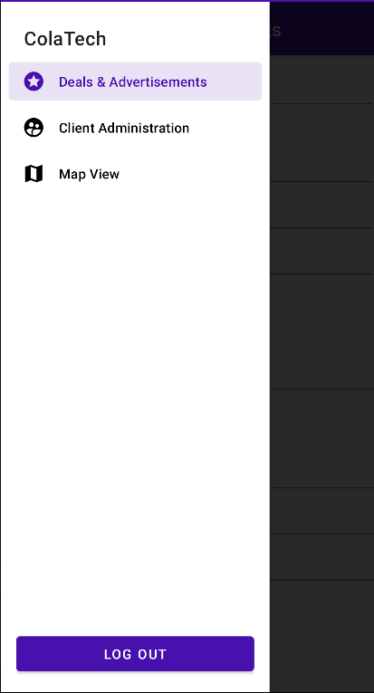

# Simple Android Navigation Drawer

In this project I present a simple solution to adding an extendable
navigation drawer for Android projects that use activities rather than fragments. This also allows existing projects to be converted over with minimal fuss. A reasonable amount of Android experience is assumed but I hope the instructions are as clear as possible. Any feedback is welcome, thanks.

## Usage

There are two main source files for this project: `NavigatorActivity`, `NavigatorMenuListener`, and `NavigatorMap`. There are also four resource files: `navigator_action_bar`, `navigator_header`, `navigator_layout`, and `navigator_menu`. Before anything else the context must be configured in the `NavigatorMenuListener` class. This context is used to actually start the activities when they are selected. One solution can be found [here](https://stackoverflow.com/questions/2002288/static-way-to-get-context-in-android), but you can always just cache a context from the calling activity.

To create a navigable activity start by extending the `NavigatorActivity` class. The constructor requires three Android resource IDs: a title string for the action bar, the class's activity layout, and navigation menu item. For example:

```
import com.caluneo.navigation.NavigatorActivity;

public class MyActivity extends NavigatorActivity {

  public MyActivity() {
    super(R.id.action_bar_title, R.layout.activity_layout, R.id.nav_menu_item);
  }
}

```

Everything else is managed through the `onCreate` function. To add the functionality for the menu item you have to add it through the `NavigatorMap` class. The cleanest way I could think of doing this is by adding a static block of inserts somewhere in your main activity, i.e.:

```
static {
  NavigatorMap.insert(R.id.nav_menu_item, R.layout.activity_layout, MyActivity.class);
  ...
}

```

Adding a menu item for the activity is done through the `res/menu/navigator_menu.xml` file. Continuing from above, to add a menu item for our new activity:

 ```
 <menu xmlns:android="http://schemas.android.com/apk/res/android">
    ...
        <item
            android:id="@+id/nav_menu_item"
            android:icon="@drawable/menu_icon"
            android:title="@string/menu_text" />
    ...
</menu>
 ```

 Since it is an Android menu you can also add groups and dividers. Finally, to add the navigation pane to your layout make a copy of `res/layout/navigator_layout.xml`. Inside you'll find three distinct elements: the action bar include, the activity layout include, and the actual navigation view. The navigation view has a `LinearLayout` container for elements you want to add at the bottom of the view, e.g. a log out button. Add an include for your activity's layout between the action bar and navigation view as such:

 ```
 <!-- ACTION BAR INCLUDE -->
   <include
      layout="@layout/toolbar"/>

<!-- ACTIVITY LAYOUT INCLUDE GOES HERE -->
  <include
      android:layout_width="match_parent"
      android:layout_height="wrap_content"
      layout="@layout/activity_layout"/>

    ....
 ```

One caveat is that you have to add at least `64dp` (or whatever the height of your action bar is defined as) of padding at the top of your activity's layout to account for the action bar. I haven't found a way around this yet, sorry. But, this system allows you to keep your currently made layouts without having to change much. You should now have a functioning navigation pane and can follow this process for all the activities you want.

## Screenshots

Here is a screenshot of the menu in action:


